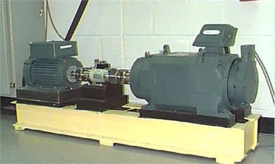
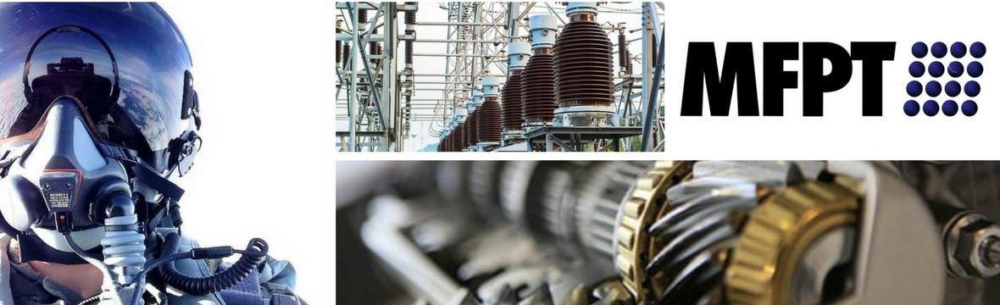
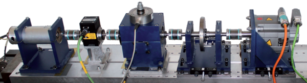
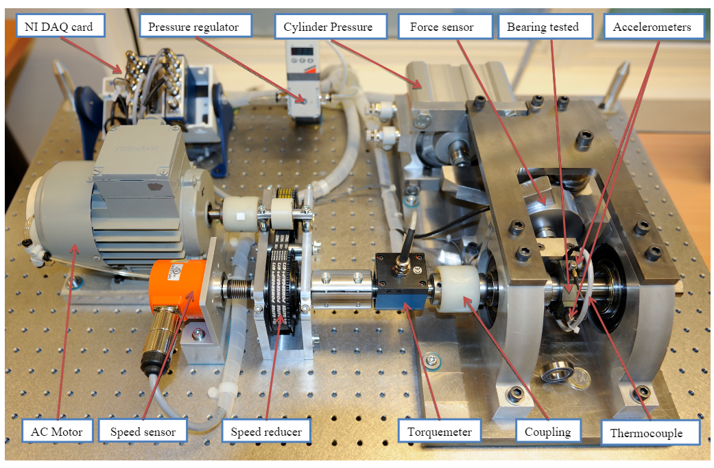
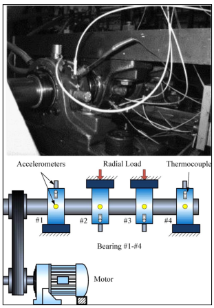
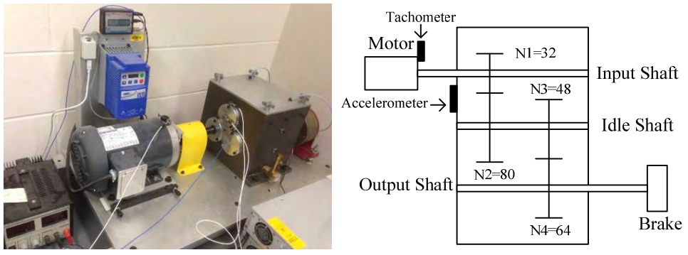
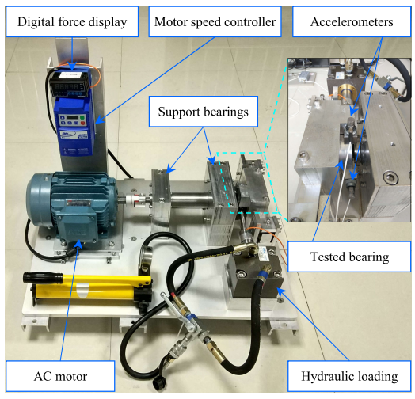
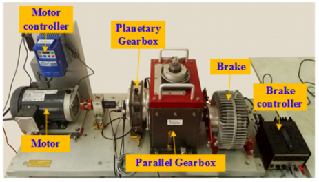
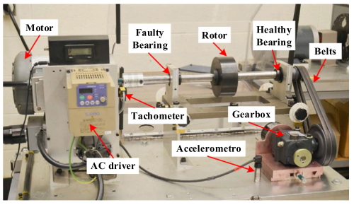
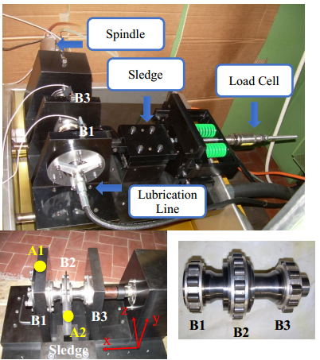

**RoadMap**
<!-- TOC -->

- [1.简介](#1简介)
- [2.美国-凯斯西储大学轴承数据中心轴承数据集](#2美国-凯斯西储大学轴承数据中心cwru)
- [3.美国-机械故障预防技术学会MFPT](#3美国-机械故障预防技术学会mfpt)
- [4.德国-帕德伯恩大学Paderborn轴承数据集](#4德国-帕德伯恩大学paderborn)
- [5.法国-FEMTO-ST轴承数据集](#5法国-femto-st轴承数据集)
- [6.美国-辛辛那提大学IMS轴承数据集](#6美国-辛辛那提大学ims)
- [7.美国-康涅狄格大学University of Connecticut轴承数据集](#7美国-康涅狄格大学university-of-connecticut)
- [8.中国-西安交通大学 轴承数据集XJTU-SY Bearing Datasets](#8xjtu-sy-bearing-datasets西安交通大学-轴承数据集)
- [9.中国-东南大学齿轮箱数据集](#9东南大学齿轮箱数据集)
- [10.Acoustics and Vibration Database（振动与声学数据库）](#10acoustics-and-vibration-database振动与声学数据库)
- [11.机械设备故障诊断数据集及技术资料大全](#11机械设备故障诊断数据集及技术资料大全)
- [12.美国-宇航局预测数据存储库-CoE Datasets](#12coe-datasets美国宇航局预测数据存储库)
- [13.中国-第三届工业大数据创新竞赛旋转机械数据集](#13第三届工业大数据创新竞赛)
- [14.加拿大-渥太华大学轴承数据集](#14加拿大-渥太华大学)
- [15.意大利-都灵理工大学轴承数据DIRG BearingData](#15-意大利-都灵理工大学轴承数据dirg_bearingdata)
- [16.巴西-里约热内卢联邦大学 MAFAULDA轴承数据集](#16巴西-里约热内卢联邦大学-mafaulda)

<!-- /TOC -->

# Rotating-machine-fault-data-set  

Open rotating mechanical fault data set
======

## 1.简介
  众所周知，当下做机械故障诊断研究最基础的就是数据，再先进的方法也离不开数据的检验。笔者通过文献资料收集到如下几个比较常用的数据集并进行整理。鉴于目前尚未见比较全面的数据集整理介绍。数据来自原始研究方，笔者只整理数据获取途径。如果研究中使用了数据集，请按照版权方要求作出相应说明和引用。在此，公开研究数据的研究者表示感谢和致敬。如涉及侵权，请联系我删除（787452269@qq.com）。
  欢迎相关领域同仁一起交流。很多优秀的论文都有数据分享，本项目保持更新。星标是比较通用的数据集。个别数据集下载可能比较困难，需要的可以邮件联系我，如版权方有要求，述不提供。
关于数据使用的问题和心得，欢迎在`Issues`中提问讨论。也欢迎`fork`,`Watch`,`star`。

> 注：给索要数据的朋友，希望是真的试过了无法获取再来索要。伸手党确实不受欢迎。另外，也欢迎修改提供公开的新数据源。

## 2.[☆美国-凯斯西储大学轴承数据中心CWRU）](./doc/CWRU.md)
   
   由美国凯斯西储大学完成试验，是当前轴承振动信号处理，故障诊断方面论文使用最为广泛的标准数据集。故障特征明显，可参考的文献资料多。可以作为方法的基础检验数据集。GitHub上也有很多以该数据集为例子的项目，值得借鉴学习。后续会逐渐对该数据集的使用情况进行总结综述。欢迎提供素材。  
	
## 3.[☆美国-机械故障预防技术学会MFPT](./doc/MFPT.md)
  
  由美国机械故障预防技术学会提供，NRG Systems总工程师Eric Bechhoefer博士代表MFPT组装和准备数据，已提供轴承故障数据集以促进轴承分析的研究。
  该数据集包括来自轴承试验台的数据:
  - 正常轴承数据
  - 不同载荷下的外圈故障数据
  - 不同载荷下的内圈故障数据
  - 以及三个真实故障案例数据  
  
## 4.[☆德国-帕德伯恩大学Paderborn](./doc/Paderborn.md)
  
  由德国帕德博恩大学 Christian Lessmeier,Enge-Rosenblatt, Bayer, & Zimmer, 于2014年设计完成实验。

## 5.[☆法国-FEMTO-ST轴承数据集](./doc/FEMTO_ST.md) 

 由FEMTO-ST研究所建立的PHM IEEE 2012数据挑战期间使用的数据集。

## 6.[☆美国-辛辛那提大学IMS](./doc/IMS.md)
  
由美国辛辛那提大学李杰教授团队分享。
The  IMS bearing dataset has  been  collected  on  an  endurance  test  rig  of  the University  of  Cincinnati and  relased  in  2014.
. The test  rig  has  the following characteristics:
- 4 double row bearings of type Rexnord ZA-2115,
- 2000 rpm stationary speed,
- 6000 lbs load applied onto the shaft and bearing by a spring mechanism,
- PCB 253B33 High sensitivity Quart ICP accelerometers.

## 7.[美国-康涅狄格大学University of Connecticut](./doc/Connecticut.md)
  

 由美国康涅狄格大学唐炯教授团队分享。齿轮箱故障数据。

## 8.[XJTU-SY Bearing Datasets（西安交通大学 轴承数据集）](./doc/XJTU_SY.md)
   

由西安交通大学雷亚国课题组王彪博士整理。为轴承寿命退化数据。

## 9.[东南大学齿轮箱数据集](./doc/SEU.md)
 

* github连接：https://github.com/cathysiyu/Mechanical-datasets
由东南大学严如强团队博士生邵思雨完成。  
论文：**“Highly Accurate Machine Fault Diagnosis Using Deep Transfer Learning”**  

Gearbox dataset is from Southeast University, China.  
These data are collected from Drivetrain Dynamic Simulator.   
This dataset contains 2 subdatasets, including bearing data and gear data, which are both acquired on Drivetrain Dynamics Simulator (DDS).   
There are two kinds of working conditions with rotating speed - load configuration set to be 20-0 and 30-2.   
Within each file, there are 8rows of signals which represent: 1-motor vibration, 2,3,4-vibration of planetary gearbox in three directions: x, y, and z, 5-motor torque, 6,7,8-vibration of parallel gear box in three directions: x, y, and z. Signals of rows 2,3,4 are all effective. 

## 10.Acoustics and Vibration Database（振动与声学数据库） 
  
提供一个收集振动故障数据集的公益性网站链接：http://data-acoustics.com/

## 11.机械设备故障诊断数据集及技术资料大全
  

有比较多的机械设备故障数据资料：https://mekhub.cn/machine-diagnosis

## 12.CoE Datasets美国宇航局预测数据存储库
   

* 链接：https://ti.arc.nasa.gov/tech/dash/groups/pcoe/prognostic-data-repository/  

## 13.第三届工业大数据创新竞赛
   

  需要参赛才能下载数据，数据使用需要获得版权方授权。多台压缩机，汽轮机的转子部件脱落数据。很实用。  
比赛已经结束，无法下载。期待官方发布白皮书。获得授权可以分享数据。   
   [工业大数据创新平台](http://industrial-bigdata.com/competition/competitionAction!showDetail2019.action?competition.competitionId=5)

## 14.加拿大-渥太华大学  
 

该数据包含在时变转速条件下从不同健康状况的轴承收集的振动信号。总共有36个数据集。对于每个数据集，有两个实验设置：轴承健康状况和变化速度条件。  
轴承的健康状况包括:  
（i）健康，  
（ii）内圈缺陷有缺陷，以及   
（iii）外圈缺陷有缺陷。  
操作转速条件是:   
（i）增加速度，  
（ii）减小速度，  
（iii）增加然后减小速度，以及  
（iv）减小然后增加速度。  
因此，设置有12种不同的情况。为了确保数据的真实性，每个实验设置收集3个试验，总共产生36个数据集。  
每个数据集包含两个通道：   
'Channel_1' 是由加速度计测量的振动数据，   
'Channel_2'是由编码器测量的转速数据。  
所有这些数据都以200,000Hz采样，采样持续时间为10秒。

  * 论文链接：(https://www.sciencedirect.com/science/article/pii/S2352340918314124?via%3Dihub)
  * 数据链接：(https://data.mendeley.com/datasets/v43hmbwxpm/1)
  * 已经发表的论文：[Bearing fault diagnosis under unknown time-varying rotational speed conditions via multiple time-frequency curve extraction](https://www.sciencedirect.com/science/article/pii/S0022460X17307678?via%3Dihub)
  * [A method for tachometer-free and resampling-free bearing fault diagnostics under time-varying speed conditions](https://www.sciencedirect.com/science/article/pii/S026322411831011X)
  
 ## 15. 意大利-都灵理工大学轴承数据DIRG_BearingData
  

 在都灵理工大学机械和航空航天工程系 DIRG实验室设置的钻机收集的数据，专门用于测试高速航空轴承，其加速度采集在可变转速，径向载荷和损伤水平，与温度测量一起，可作为开放存取数据提供。
 * 数据链接:(ftp://ftp.polito.it/people/DIRG_BearingData/)
 * 论文链接:[The Politecnico di Torino rolling bearing test rig: Description and analysis of open access data](https://www.sciencedirect.com/science/article/pii/S0888327018306800?via%3Dihub)
 
 ## 16.巴西-里约热内卢联邦大学 MAFAULDA
      
 * 数据链接：(http://www02.smt.ufrj.br/~offshore/mfs/page_01.html)
 * Marins M A, Ribeiro F M L, Netto S L, et al. Improved similarity-based modeling for the classification of rotating-machine failures[J]. Journal of the Franklin Institute, 2018, 355(4): 1913-1930.[论文链接](https://www.sciencedirect.com/science/article/pii/S0016003217303678)
 * Saufi S R, bin Ahmad Z A, Leong M S, et al. Differential evolution optimization for resilient stacked sparse autoencoder and its applications on bearing fault diagnosis[J]. Measurement Science and Technology, 2018, 29(12): 125002. [论文链接](https://iopscience.iop.org/article/10.1088/1361-6501/aae5b2/meta)

